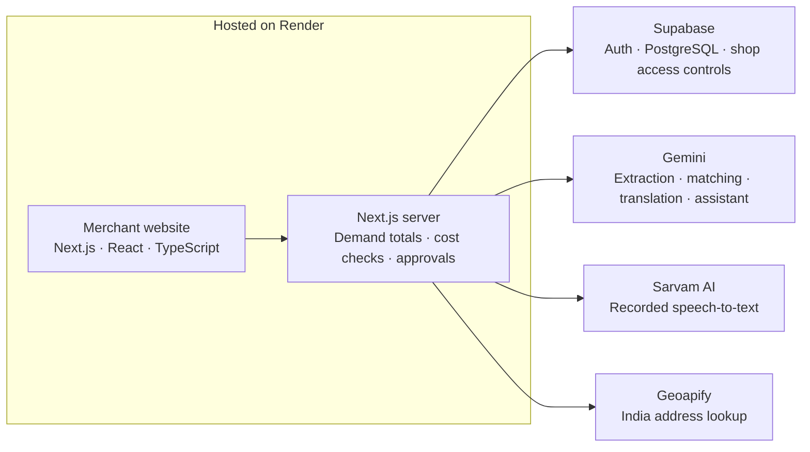

# NahiMila

**Turn missed customer requests into demand merchants can act on.**

Team Commit and Run

NahiMila helps Indian kirana merchants capture unavailable-item requests, identify nearby demand and share a supplier case when exact customer confirmations and each shop’s cash limit support it. Initial procurement focus: sealed, shelf-stable packaged goods.

**[Try the working prototype](https://nahimila.onrender.com/)** → **Explore the demo** → No signup required.

## What works today

- **Private demand book:** record requests even when customers cannot wait; retain exact product variants, packs and quantities.
- **Nearby demand signals:** anonymous local interest helps merchants decide what to consider stocking. Interest is distinct from confirmed purchasing demand.
- **Reviewed multilingual input:** English, Hindi and Kannada text, recorded speech transcription, product extraction and an assistant that prepares reviewable drafts.
- **Exact customer offers:** acceptance applies to the agreed item, quantity, price and pickup date. A name or phone number alone does not confirm a purchase.
- **Supplier quote comparison:** merchant-entered quotes are checked against product identity, whole-case quantities, total cost, delivery deadlines and cash limits.
- **Independent shop approvals:** each shop approves its own allocated units and cost. Relevant changes invalidate stale approvals; repeated actions count once.
- **Outcome tracking:** simulated orders, receipt, pickups and remaining stock show the full prototype workflow.

## Merchant benefit: an illustrative example

A supplier case contains 24 units at ₹42 each, plus ₹24 delivery. Three shops each have eight customer-confirmed units.

| Per shop | Buy a full case alone | Three shops share equally |
| --- | ---: | ---: |
| Cash committed | ₹1,032 | ₹344 |
| Units without customer confirmation | 16 | 0 |

Full case: `(24 × ₹42) + ₹24 = ₹1,032`. Each shop’s share: `₹1,032 ÷ 3 = ₹344`.

**₹688 less cash committed per shop** in this example. This is illustrative arithmetic, not measured field impact.

## Architecture

AI interprets requests and explains authorized shop records. **Backend rules calculate quantities and costs and decide whether an order can proceed.** Gemini cannot approve spending or place orders. OpenStreetMap provides map tiles.

## Short demo walkthrough

On the hosted site, choose **Explore the demo**. Use **Reset demo** to restore the shared fictional scenario when needed; this affects other demo visitors.

1. Record an unavailable item for a customer who cannot wait. It appears in the private demand book and does not support an order.
2. Open Nearby to see your requests separately from anonymous nearby interest. Different packs and flavours remain distinct for procurement.
3. Open the Masala 100g supplier choice: 23 confirmed units cannot fill its 24-unit case. In Requests, open Asha’s pending offer and confirm once. The case reaches 24 units; duplicate confirmation adds nothing. Withdraw before ordering to show the case blocking again and approvals being invalidated.
4. Open Lime 100g: 12 units are confirmed, with two neighboring demo shops’ approvals preloaded. Review your four-unit share at ₹148. The cheaper ₹136 option arrives after the agreed deadline and is blocked. Approve your own share, then create a simulated order.
5. Record receipt and collection of your four units. At the demo selling price of ₹50 each, the app records ₹200 collected against the immutable ₹148 supplier-cost share. Repeating pickup does not count it twice.
6. Switch to Hindi or Kannada. When Sarvam is configured, record a short request and stop; transcription appears after processing. Ask NahiMila about an order blocker or prepare a request draft, then review it before saving.

The 24-unit Masala scenario is separate from the 12-unit Lime scenario. **Do not present a repeated confirmation as additional customer demand.**

## Verification

The last implementation checks recorded 235 passing automated tests, lint and a production build. Tests cover authentication boundaries, owner-scoped data, product matching, cash checks, approval invalidation, duplicate protection and pickup accounting. Live integration checks verified English, Hindi and Kannada extraction and Hindi assistant drafts; they are not a merchant pilot.

A real device’s microphone permissions still need rehearsal.

## Prototype scope and next steps

The demo uses fictional customer/supplier data and simulated orders, receipts and pickups. It does not process real payments, deposits, refunds, supplier bids or supplier fulfilment. Customer confirmation does not guarantee collection. There has not yet been a merchant pilot.

Next steps:

- Pilot with nearby shops to measure actual pickups, cash committed, unsold stock and distribution effort.
- Explore supplier bidding for pooled demand.
- Evaluate optional refundable deposits for higher-risk special orders.

The latter two are planned explorations. Additional regional languages are also planned.

## Further documentation

- [Technical implementation notes](docs/technical-notes.md): product identity, privacy thresholds, authorization, persistence and AI usage controls.
- [Judge documentation](https://gist.github.com/Sanjay02v/7280c5db3fc9ad562aeec2a1a65fee01): a concise companion to the submitted slides.

Source layout: `src/app` contains pages and API routes; `src/components/merchant` contains the merchant interface; `src/lib/product` and `src/lib/engine` implement the workflow; `supabase/migrations` contains database setup; `tests` contains automated checks.
